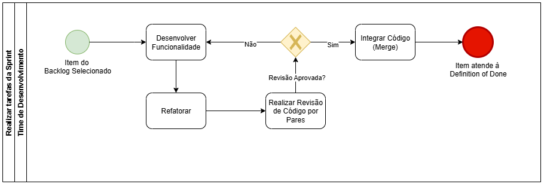

# BPMN de Metodologias

## Descrição do Processo de Desenvolvimento

Este diagrama representa a visão macro do ciclo de vida do desenvolvimento do projeto, baseado no framework **Scrum**. Ele detalha as cerimônias principais que serão utilizadas no projeto, os papéis envolvidos e o fluxo iterativo de entrega de valor, garantindo que o processo seja adaptável e centrado no feedback contínuo.

### 1. Evento de Início (círculo verde)
O processo se inicia, marcando o ponto de partida do projeto.

### 2. Definir e Priorizar Product Backlog
Atividade de responsabilidade do Product Owner (P.O.), que consiste em criar, detalhar e ordenar a lista de todas as funcionalidades e requisitos desejados para o produto.

### 3. Realizar Sprint Planning 
Cerimônia colaborativa entre o P.O. e o Time de Desenvolvimento, na qual o time seleciona um conjunto de itens do Product Backlog para trabalhar na próxima iteração (Sprint), criando o Sprint Backlog.

### 4. Execução da Sprint (Subprocesso)
Representa o período de tempo (time-box) em que o Time de Desenvolvimento trabalha focado em construir um incremento de produto funcional a partir dos itens do Sprint Backlog. As atividades detalhadas deste período são representadas em um diagrama de nível 2.

### 5. Gateway Paralelo (divisão)
Ao final da Sprint, o fluxo se divide, indicando que duas cerimônias de encerramento ocorrerão em paralelo ou sem dependência de ordem entre si.

### 6. Realizar Sprint Review
Cerimônia na qual o Time de Desenvolvimento apresenta o trabalho concluído na Sprint para o Product Owner e outras partes interessadas, com o objetivo de inspecionar o incremento e obter feedback.

### 7. Realizar Sprint Retrospective
Cerimônia facilitada pelo Scrum Master, na qual o Time de Desenvolvimento reflete sobre a Sprint que acabou, identificando pontos de melhoria no processo, nas ferramentas e na colaboração da equipe.

### 8. Gateway Paralelo (junção)
Sincroniza o fluxo após a conclusão da Review e da Retrospectiva, garantindo que ambas tenham terminado antes de prosseguir.

### 9. Gateway Exclusivo (Projeto Concluído?)
Ponto de decisão sob responsabilidade do Product Owner. Se o produto atingiu seus objetivos e não há mais Sprints a serem planejadas, o projeto é considerado concluído. Caso contrário, o processo retorna para uma nova fase de planejamento.

### 10. Evento Final (círculo vermelho)
Representa o término bem-sucedido e a entrega final do projeto. Se o caminho "Não" for tomado no gateway anterior, o fluxo retorna ao passo 3 (`Realizar Sprint Planning`) para iniciar um novo ciclo iterativo.

## Execução da Sprint
Antes da realização da sprint, realizaremos reuniões de Sprint Planning para definir as atividades que serão executadas. Durante a Sprint realizaremos reuniões rápidas diariamente para reportar o desenvolvimento da Sprint, ao final da Sprint será feita a reunião de Sprint Review em que discutiremos as tarefas feitas e não feitas.

### BPMN da execução da Sprint
A figura 2 apresenta um modelo de MPN que representa o fluxo do processo da Sprint.

## Análise Detalhada do Processo

### 1. Início do Processo
O círculo verde no canto superior esquerdo é o **Evento de Início**.  
Ele marca o ponto de partida do processo, que começa assim que uma Sprint é iniciada.

---

### 2. Planejamento da Sprint (Sprint Planning)
A primeira atividade é o **"Planejamento da Sprint"**.  
O ícone de envelope indica que esta é uma **Tarefa de Mensagem**, neste caso, as metas e os itens de trabalho definidos para a Sprint.  
Aqui, a equipe define o que será feito durante o ciclo.

---

### 3. Divisão de Atividades 
Após o planejamento, o fluxo chega a um **losango com um sinal de +**.  
Este é um **Gateway Paralelo**, que divide o processo em múltiplos caminhos a serem executados simultaneamente.  
Isso significa que as duas atividades seguintes acontecem ao mesmo tempo durante a Sprint.

---

### 4. Atividades em Paralelo
- **Caminho A: Realizar Daily**  
  Esta é a tarefa de realizar as reuniões diárias (**Daily Scrums**).  
  O ícone de seta circular indica que esta é uma **Tarefa de Loop**, ou seja, ela se repete continuamente durante a Sprint.

- **Caminho B: Realizar tarefas da Sprint**  
  Esta é a execução do trabalho principal: desenvolver, testar e completar as tarefas planejadas.  
  O ícone **+ dentro da caixa** indica uma **Tarefa de Múltiplas Instâncias**, representa vários membros da equipe trabalhando em várias tarefas diferentes ao mesmo tempo.

---

### 5. Sincronização
Os dois caminhos paralelos se encontram em outro **Gateway Paralelo (+)**.  
Este gateway atua como um ponto de sincronização: o processo só continua depois que todas as atividades de entrada forem concluídas.  

No contexto da Sprint, isso significa que o ciclo de trabalho (realização das tarefas e das dailies) terminou e está pronto para ser verificado.

---

### 6. Verificar se as tarefas foram feitas
Esta é uma tarefa de **verificação**, representando a **Sprint Review**,  
onde o trabalho concluído é analisado para ver se atende aos critérios de "pronto".

---

### 7. Decisão: Tarefas realizadas? 
O fluxo chega a um **losango com um X**.  
Este é um **Gateway Exclusivo**, um ponto de decisão. Apenas um dos caminhos de saída será seguido, com base em uma condição.

**Condição:** *"Tarefas realizadas?"*

---

### 8. Caminhos da Decisão
- **Se NÃO:**  
  Caso as tarefas não tenham sido concluídas ou aprovadas, o fluxo volta para a atividade **"Realizar tarefas da Sprint"**.  
  Isso cria um ciclo de feedback para que a equipe continue trabalhando no que ficou pendente.

- **Se SIM:**  
  Se todas as tarefas foram concluídas com sucesso, o fluxo segue para a próxima etapa.

---

### 9. Atualizar Sprint Backlog
A atividade **"Atualizar o Sprint Backlog"** representa o fechamento da Sprint,  
onde os itens concluídos são marcados como "prontos" e o backlog é ajustado para o próximo ciclo de planejamento.

---

### 10. Fim do Processo 
O **círculo com borda preta grossa**, é o **Evento de Fim**.  
Ele sinaliza que o processo de **Execução da Sprint** foi concluído com sucesso e chegou ao seu término.

### BPMN Realizar Tarefas da Sprint

Este diagrama apresentado na figura 3 detalha o processo de engenharia de software, mostrando como uma única tarefa é desenvolvida e entregue dentro de uma Sprint. Ele incorpora as práticas de **eXtreme Programming (XP)**, com foco em **Refatoração** e **Revisão de Código por Pares (Code Review)**, para garantir a alta qualidade do código.

---

### 1. Início do Processo
O **Evento de Início** (círculo verde) chamado **"Item do Backlog Selecionado"** indica que uma tarefa individual do Sprint Backlog foi escolhida para ser trabalhada.

---

### 2. Desenvolver Funcionalidade
Esta é a atividade principal do fluxo. O **Time de Desenvolvimento** trabalha na implementação da funcionalidade, escrevendo o código necessário para atender aos requisitos da tarefa.

---

### 3. Refatorar
Após o desenvolvimento, a próxima atividade é a **"Refatoração"**. Esta prática de XP consiste em melhorar a estrutura interna do código, tornando-o mais limpo, legível e eficiente, sem alterar seu comportamento externo.

---

### 4. Realizar Revisão de Código por Pares
Em seguida, ocorre o **"Code Review"**. Nesta atividade, dois membros do time inspecionam o código recém-desenvolvido e refatorado para identificar potenciais problemas, bugs ou melhorias.

---

### 5. Decisão: Revisão Aprovada?
O fluxo chega a um **Gateway Exclusivo** (losango com **X**), que representa um ponto de decisão. O processo só avança se o código for aprovado na revisão.

**Caminhos da Decisão:**
- **Se NÃO:** Caso a revisão aponte correções necessárias, o fluxo retorna para a atividade **"Desenvolver Funcionalidade"**. Isso garante que o feedback seja imediatamente incorporado e que a qualidade do código seja mantida antes do avanço.

- **Se SIM:** Se o código for aprovado, o fluxo segue para a próxima etapa.

---

### 6. Integrar Código (Merge)
A atividade **"Integrar Código (Merge)"** representa a ação de mesclar o código da tarefa finalizada na **branch principal** do projeto.

---

### 7. Fim do Processo
O **Evento de Fim** (círculo vermelho) chamado **"Item atende à Definition of Done"** sinaliza que a tarefa foi concluída com sucesso e atendeu a todos os critérios de aceitação definidos pela equipe, tornando-a oficialmente "pronta".

---

## Fluxo do Usuário: Monitorias e Materiais

Este diagrama, apresentado na figura 4, detalha duas raias (pools) distintas que representam os principais fluxos de interação do usuário na plataforma: **Solicitar Monitoria** e **Enviar Material**.

.png)

### Raia 1: Solicitar Monitoria

Este fluxo descreve o processo pelo qual um usuário pode criar e publicar uma nova solicitação de monitoria.

1.  **Início:** O processo começa quando o usuário decide interagir com a funcionalidade de monitorias.
2.  **Ir pra aba de Monitorias:** O usuário navega até a seção específica de monitorias na aplicação.
3.  **Gateway Exclusivo (Deseja solicitar monitoria?):** O sistema apresenta um ponto de decisão.
    * **Se NÃO:** O usuário pode optar por não criar uma monitoria, e o fluxo retorna para a tela principal da aba, permitindo que ele visualize outras monitorias.
    * **Se SIM:** O usuário decide criar uma nova solicitação, e o fluxo avança.
4.  **Modal de Solicitar Monitoria:** Uma janela ou formulário (modal) é exibido para o preenchimento dos detalhes.
5.  **Preenchimento de Dados:** O usuário preenche as seguintes informações:
    * **Inserir Título:** Define um título claro para a monitoria.
    * **Inserir Matéria:** Especifica a disciplina ou assunto.
    * **Inserir data e horário:** Agenda o encontro.
    * **Definir Privacidade:** Escolhe se a monitoria será pública ou privada.
    * **Inserir foto:** Adiciona uma imagem opcional.
6.  **Fim do Processo:** Após preencher e confirmar os dados, a monitoria é criada e o fluxo é concluído com sucesso.

### Raia 2: Enviar Material

Este fluxo descreve o processo para um usuário compartilhar um material de estudo na plataforma.

1.  **Início:** O processo se inicia quando o usuário opta por interagir com a funcionalidade de materiais.
2.  **Ir pra aba de Materiais:** O usuário navega até a seção de materiais de estudo.
3.  **Gateway Exclusivo (Deseja enviar materiais?):** Um ponto de decisão é apresentado.
    * **Se NÃO:** O usuário pode navegar pela seção sem enviar nada, e o fluxo retorna.
    * **Se SIM:** O usuário escolhe prosseguir com o envio.
4.  **Modal de Materiais:** Um formulário específico para o upload de materiais é exibido.
5.  **Preenchimento de Dados:** O usuário fornece as seguintes informações:
    * **Inserir Título:** Dá um nome ao material.
    * **Inserir matéria:** Associa o material a uma disciplina.
    * **Inserir arquivo:** Faz o upload do documento ou arquivo.
6.  **Fim do Processo:** Após o envio do formulário, o material é adicionado à plataforma e o fluxo termina.

---

### **Histórico de Versões**

| Versão | Data       | Descrição                                              | Autor(es)    | Revisor(es) |
| ------ | ---------- | ------------------------------------------------------ | ------------ | ----------- |
| 1.0    | 05/09/2025 | Criação e desenvolvimento do documento e BPMN Sprint   | Pedro Camilo |             |
| 1.1    | 05/09/2025 | Adição da descrição do BPMN Realizar Tarefas da Sprint | Bruno Cruz   |             |
| 1.2    | 05/09/2025 | BPMN monitorias | Maria Eduarda   |             |