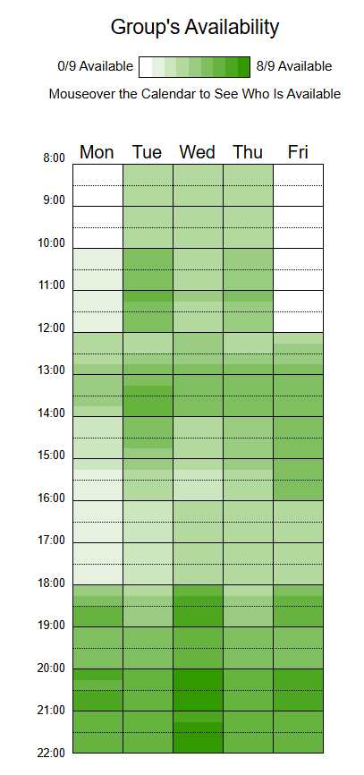

# Heatmap

Para facilitar a visualização da disponibilidade dos membros da equipe em relação a trabalho e reuniões, este documento conta com um **heatmap interativo**.  

Esse recurso permite registrar e consultar, de maneira clara e intuitiva, os horários em que cada integrante está disponível ao longo da semana.  

Com base nas informações levantadas, ficou definido que as reuniões acontecerão em **dias de semana, sempre a partir das 20h**.  

Caso seja necessário acrescentar novos encontros ou ajustar os horários já combinados, o heatmap será revisitado, e os ajustes serão feitos em conjunto com a equipe, garantindo **flexibilidade** e **alinhamento** entre todos.

---

## Heatmap de Disponibilidade

---

## Histórico de Versão

| Data       | Versão | Descrição               | Autor(es)         | Revisor(es)     |
|------------|--------|-------------------------|-------------------|-----------------|
| 04/09/2025 | 1.0    | Criação do Documento    | Maria Eduarda     |    |
