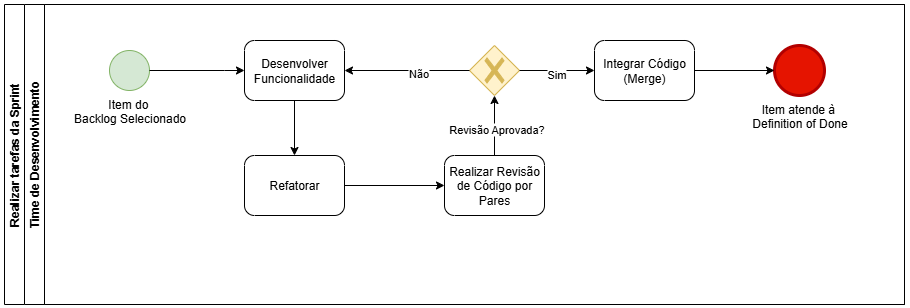

# MonitorOn (Sei e Posso Ensinar)
**Código da Disciplina:** FGA0208  
**Número do Grupo:** 08  
**Entrega:** 01

## Alunos
| Matrícula | Aluno |
| :--- | :--- |
| 221031111 | ANNE DE CAPDEVILLE |
| 251005945 | ATYRSON SOUTO DA SILVA |
| 222006605 | BRUNO CRUZ GARCIA ROSA |
| 221031274 | FELIPE MATHEUS RIBEIRO LOPES |
| 231037709 | JOAO VICTOR FELIX MOREIRA |
| 231026474 | MARIA EDUARDA ARAUJO PEREIRA |
| 231011785 | PEDRO TULIO CURVELO CAMILO |
| 221031238 | VICTOR AUGUSTO DE SOUSA CAMARA |
| 222006220 | YAN LUCAS SOUZA GUIMARAES |

## Sobre
O MonitorOn é um software de gestão acadêmica que desenvolvemos para conectar alunos a monitores qualificados de forma eficiente e estruturada. A plataforma permite que os estudantes encontrem suporte para seus estudos através de aulas ao vivo, acesso a materiais de apoio e um chat direto para tirar dúvidas.

## Screenshots da Primeira Entrega

### Rich Picture

### Mapa Mental

### BPMN

### Protótipo

## Há algo a ser executado?

[ ] SIM
[X] NÃO

Se SIM, insira um manual (ou um script) para auxiliar ainda mais os interessados na execução.

## Informações Complementares

Quaisquer outras informações adicionais podem ser descritas nessa seção.

# Histórico de Versões

| Versão | Data | Descrição | Autor(es) | Revisor(es) |
| :--- | :--- | :--- | :--- | :--- |
| 1.0 | 05/09/2025 | Criação e desenvolvimento do documento | Joao Moreira | |